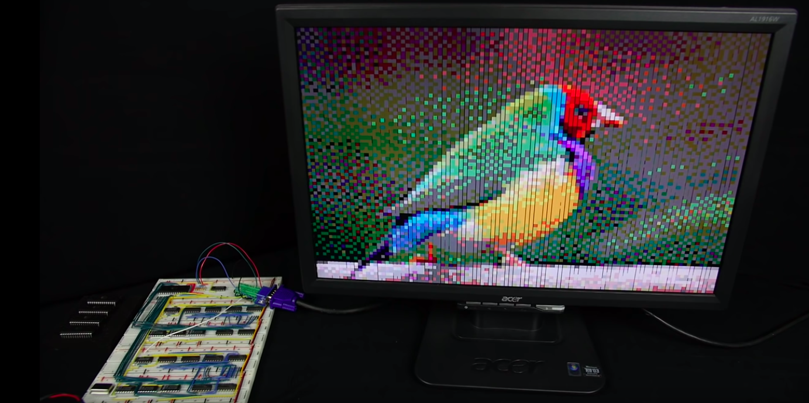

# Házi

## 1

- Nézzétek meg ezt a [videót](https://www.youtube.com/watch?v=wvJc9CZcvBc&feature=share&fbclid=IwAR1hnwQuJA0fN8JhTg2CDeI-2woN3xIBzKuXtIzeVdVHzfE46cfc05H3XDM), amiben a faszi bemutatja, hogyan áll össze egy bonyolultabb összeadó, és ténylegesen meg is építi a gépet.
- Ha mélyebben érdekel a téma, érdemes megnézni ezt a kétrészes videósorozatot is ([első](https://www.youtube.com/watch?time_continue=738&v=l7rce6IQDWs&feature=emb_logo&fbclid=IwAR2gdCGpGMqVgul2H6PUMcpmJGR3Zq-3zvka-qWTwoFcoEgR56IKRoNjQIA), [második](https://www.youtube.com/watch?v=uqY3FMuMuRo&feature=youtu.be&fbclid=IwAR3I1DtZ5T_X8mFlfBGPiF_UAgGnrNGYDqjw9GmJWc1e8wug5rU8Ag8tpyA)), ahol ugyanezen az elven létrehozza az alábbi képet egy madárról. (opcionális)
- Csütörtökig írjatok vagy (a) az első videóhoz kettő, vagy (b) az első videóhoz egy, és a másik kettő közül bármelyikhez mégegy kérdést **a logika prekurzushoz tartozó gmail threadbe**. A pénteki kurzusig pedig válasszatok ki a többiek kérdései közül egyet, és válaszoljátok meg ugyanitt (first come, first served alapon).



## 2.

A következő állításokat fejezzétek ki változók, kvantorok és műveletek segítségével, és töltsétek fel ide a kurzuson bemutatott módon.

**Predikátumok:**
- F(x): *x férfi*
- N(x): *x nő*
- P(x, y): *y személy x személy gyereke*

**Kifejezendő állítások:**
- A) *k-nak és d-nek van közös lánya*
- B) *csak a férfiak között vannak gyermektelenek*
- C) *vannak egynemű testvérek*

 Segítségnek a ```notation.pdf``` fájlban találjátok a kurzuson használt jelöléseket, és az eddigi kvantoros feladatok megoldását.

